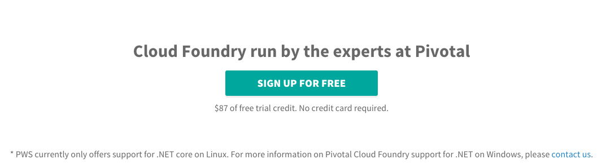

# PAS Workshops:

### Environment
- PAS on PEZ  (temporary e)
  - Ops Manager : https://opsmgr-01.haas-261.pez.pivotal.io
  - Apps Manager : https://apps.run.haas-261.pez.pivotal.io
  - PAS API Server : https://api.run.haas-261.pez.pivotal.io

or 
- Pivotal Web Services : https://run.pivotal.io



<!-- 
  or
- PAS on Azure
  - Ops Manager : https://opsmgr.pcf.kr.pivotal.io
  - Apps Manager : https://apps.sys.pcf.kr.pivotal.io
  - PAS API Server : https://api.sys.pcf.kr.pivotal.io
 -->

### Hands-on Materials:
### Deploy the Sample App

- Spring Cloud Services - Microserivces Workshop : https://bit.ly/2yYYB4B

```bash
# Login 
cf login -a api.run.haas-226.pez.pivotal.io -u jhwang -p <> --skip-ssl-validation
```

cf push cf-demo-app

### View the Logs
```bash
cf logs cf-demo --recent
```
or
```bash
cf logs cf-demo
```

- Timestamp
- Log type
- Channel
- Message

### Connect a Database
- List the available ElephantSQL plans:
```bash
cf marketplace -s elephantsql
```
- Create a service instance
```bash
cf create-service elephantsql turtle cf-demo-db
```
- Bind the created service to the app
```bash
cf bind-service cf-demo cf-demo-db
```
Once a service is bound to an app, environment variables are stored that allow the app to connect to the service after a push, restage, or restart command.

- Restage the app
```bash
cf restage cf-demo
```
- Verify the new service is bound to the app
```bash
cf services
```

### Scale the App

```bash
cf scael cf-demo-app -i 
```

- Auto Scaling


```kotlin

@RestController
class RestController {
  fun prices(@PathVariable symbol: String) Flux<StockPrice> {
    return Flux.interval(Duration.ofSeconds(1))
              .map { StockPrice(symbol, randomStockPrice(), now()) }
  }

  private fun randomStockPrice(): Double {
    return ThreadLocalRandom.current().nextDouble(100.0)
  }


}

data class StockPrice(val symbol: String, 
                      val price: Double,
                      val datetime: LocalDateTime)


```